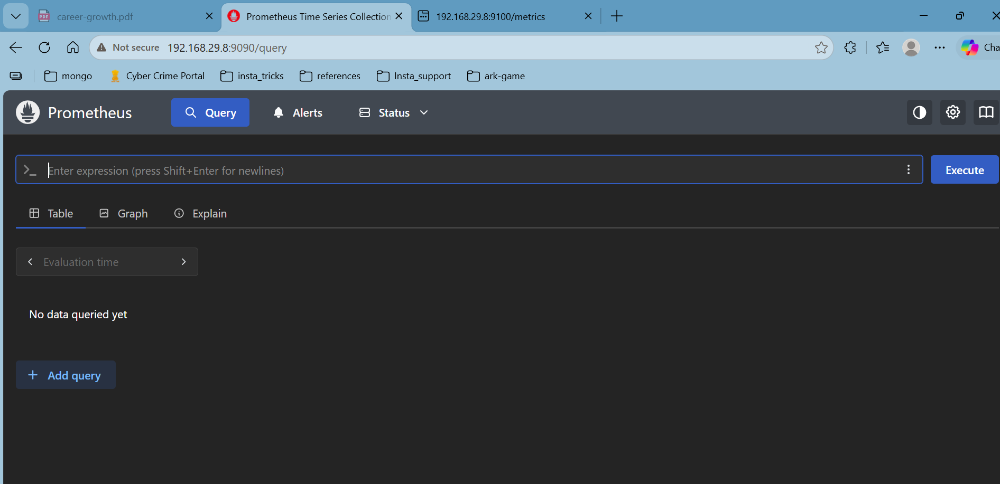
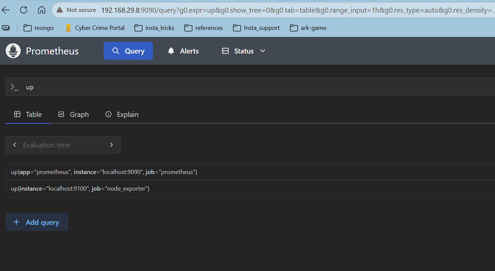
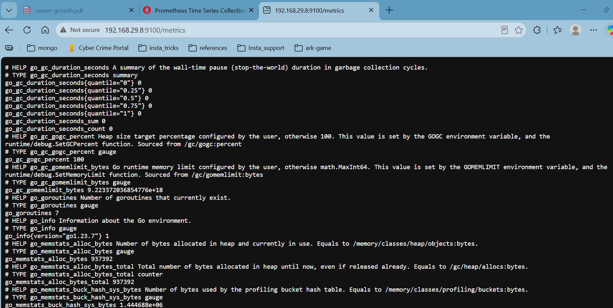

# Prometheus installation

This document contains the complete, step-by-step process performed so far to install Prometheus and Node Exporter. All steps are preserved and presented in a clear, ordered sequence.

## 1) Install Prometheus

1. Update system packages:

```bash
sudo apt update && sudo apt upgrade -y
```

2. Download Prometheus (the same version referenced previously):

```bash
wget https://github.com/prometheus/prometheus/releases/download/v3.5.3/prometheus-3.5.3.linux-amd64.tar.gz
```

3. Create directories and user for Prometheus:

```bash
sudo mkdir -p /etc/prometheus
sudo mkdir -p /var/lib/prometheus
sudo useradd --no-create-home --shell /bin/false prometheus
sudo chown prometheus:prometheus /etc/prometheus
sudo chown prometheus:prometheus /var/lib/prometheus
```

4. Extract the downloaded archive and copy binaries and config:

```bash
tar -xvf prometheus-3.5.3.linux-amd64.tar.gz
cd prometheus-3.5.3.linux-amd64/
sudo cp prometheus /usr/local/bin/
sudo cp promtool /usr/local/bin/
sudo chown prometheus:prometheus /usr/local/bin/prometheus
sudo chown prometheus:prometheus /usr/local/bin/promtool
sudo cp prometheus.yml /etc/prometheus/
sudo chown prometheus:prometheus /etc/prometheus/prometheus.yml
```

5. Create the systemd service file `/etc/systemd/system/prometheus.service` with the following contents:

```ini
[Unit]
Description=Prometheus Monitoring
Wants=network-online.target
After=network-online.target

[Service]
User=prometheus
Group=prometheus
Type=simple
ExecStart=/usr/local/bin/prometheus \
  --config.file=/etc/prometheus/prometheus.yml \
  --storage.tsdb.path=/var/lib/prometheus/
Restart=always

[Install]
WantedBy=multi-user.target
```

6. Reload systemd, start and enable Prometheus:

```bash
sudo systemctl daemon-reload
sudo systemctl start prometheus
sudo systemctl enable prometheus
sudo systemctl status prometheus
```

The service status should show `active (running)`.


---

## 2) Install Node Exporter

1. Create a system user for Node Exporter:

```bash
sudo useradd --no-create-home --shell /bin/false node_exporter
```

2. Download Node Exporter (as referenced previously):

```bash
wget https://github.com/prometheus/node_exporter/releases/download/v1.9.1/node_exporter-1.9.1.linux-amd64.tar.gz
```

3. Extract and install the binary:

```bash
tar -xvf node_exporter-1.9.1.linux-amd64.tar.gz
cd node_exporter-1.9.1.linux-amd64/
sudo cp node_exporter /usr/local/bin/
sudo chown node_exporter:node_exporter /usr/local/bin/node_exporter
```

4. Create the systemd service file `/etc/systemd/system/node_exporter.service` with the following contents:

```ini
[Unit]
Description=Node Exporter
Wants=network-online.target
After=network-online.target

[Service]
User=node_exporter
Group=node_exporter
Type=simple
ExecStart=/usr/local/bin/node_exporter
Restart=always

[Install]
WantedBy=multi-user.target
```

5. Reload systemd, start and enable Node Exporter:

```bash
sudo systemctl daemon-reload
sudo systemctl start node_exporter
sudo systemctl enable node_exporter
sudo systemctl status node_exporter
```

The service status should show `active (running)`.

---

## 3) Configure Prometheus to scrape Node Exporter

1. Edit `/etc/prometheus/prometheus.yml` and ensure it contains the Prometheus and Node Exporter scrape configs. The file used earlier looks like this:

```yaml
# my global config
global:
  scrape_interval: 15s
  evaluation_interval: 15s

alerting:
  alertmanagers:
    - static_configs:
        - targets:
          # - alertmanager:9093

rule_files:
  # - "first_rules.yml"
  # - "second_rules.yml"

scrape_configs:
  - job_name: "prometheus"
    static_configs:
      - targets: ["localhost:9090"]
        labels:
          app: "prometheus"

  - job_name: 'node_exporter'
    static_configs:
      - targets: ['localhost:9100']
```

2. After saving changes, restart Prometheus:

```bash
sudo systemctl restart prometheus
sudo systemctl status prometheus
```

---

## 4) Verification and notes

- Verify Prometheus web UI at `http://<server-ip>:9090`.
- Verify Node Exporter metrics at `http://<server-ip>:9100/metrics`.




----------------------------------------------------------


now installing grafana 

1. Install Dependencies
sudo apt update

sudo apt install -y software-properties-common apt-transport-https wget gpg
2. Add Grafana GPG Key
sudo mkdir -p /etc/apt/keyrings
wget -q -O - https://apt.grafana.com/gpg.key | \
gpg --dearmor | \
sudo tee /etc/apt/keyrings/grafana.gpg > /dev/null
3. Add Repository
echo "deb [signed-by=/etc/apt/keyrings/grafana.gpg] https://apt.grafana.com stable main" | \
sudo tee /etc/apt/sources.list.d/grafana.list
4. Install Grafana
sudo apt update

sudo apt install grafana -y
5. Start Grafana
sudo systemctl daemon-reload

sudo systemctl enable grafana-server
sudo systemctl start grafana-server
6. Verify
sudo systemctl status grafana-server

Should show:

active (running)

open browser 192.168.29.8:3000 for the web UI

default login 

username: admin
password: admin

connect prometheus to grafana 

connections --> data sources ---> add data source ---> prometheus


save & test


import dashboard 

Create dashboard from prometheus to grafana and save it. 


Install alert manager 


create user for alert manager 

 sudo useradd --no-create-home --shell /bin/false alertmanager

 download source file from internet 

 wget https://github.com/prometheus/alertmanager/releases/download/v0.28.1/alertmanager-0.28.1.linux-amd64.tar.gz

 unzip the file 

 tar -xvf alertmanager-0.28.1.linux-amd64.tar.gz

enter to unzipped folder 

cd alertmanager-0.28.1.linux-amd64/

moving files to necessary locations 

sudo cp alertmanager /usr/local/bin/
sudo cp amtool /usr/local/bin/

sudo chown alertmanager:alertmanager /usr/local/bin/alertmanager
sudo chown alertmanager:alertmanager /usr/local/bin/amtool

sudo chown -R alertmanager:alertmanager /etc/alertmanager

# Create service for alert manager 
sudo nano /etc/systemd/system/alertmanager.service

[Unit]
Description=Alertmanager
Wants=network-online.target
After=network-online.target

[Service]
User=alertmanager
Group=alertmanager
Type=simple

ExecStart=/usr/local/bin/alertmanager \
  --config.file=/etc/alertmanager/alertmanager.yml \
  --storage.path=/var/lib/alertmanager

Restart=always

[Install]
WantedBy=multi-user.target

sudo systemctl daemon-reload
sudo systemctl enable alertmanager
sudo systemctl start alertmanager
sudo systemctl status alertmanager


sudo systemctl status alertmanager
